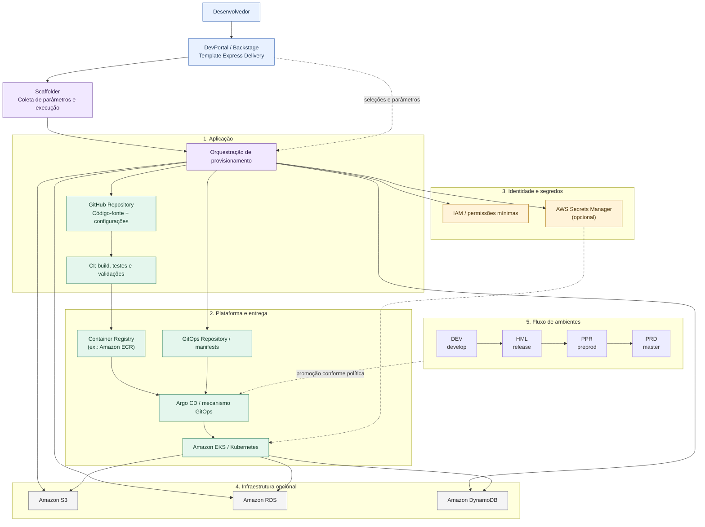

# Express Delivery — Stack do DevPortal

Cole o conteúdo do bloco Mermaid em um editor Mermaid compatível ou use-o como referência para reconstruir o diagrama no Miro.

```mermaid
flowchart TB
    DEV["Desenvolvedor"] --> PORTAL["DevPortal / Backstage<br/>Template Express Delivery"]
    PORTAL --> SCAF["Scaffolder<br/>Coleta de parâmetros e execução"]
    SCAF --> ORCH["Orquestração de provisionamento"]

    subgraph APP["1. Aplicação"]
        ORCH --> REPO["GitHub Repository<br/>Código-fonte + configurações"]
        REPO --> PIPE["CI: build, testes e validações"]
    end

    subgraph PLATFORM["2. Plataforma e entrega"]
        ORCH --> GITOPS["GitOps Repository / manifests"]
        PIPE --> IMAGE["Container Registry<br/>(ex.: Amazon ECR)"]
        IMAGE --> DEPLOY["Argo CD / mecanismo GitOps"]
        GITOPS --> DEPLOY
        DEPLOY --> EKS["Amazon EKS / Kubernetes"]
    end

    subgraph SECURITY["3. Identidade e segredos"]
        ORCH --> IAM["IAM / permissões mínimas"]
        ORCH --> SM["AWS Secrets Manager<br/>(opcional)"]
        SM -.-> EKS
    end

    subgraph AWS["4. Infraestrutura opcional"]
        ORCH --> S3["Amazon S3"]
        ORCH --> RDS["Amazon RDS"]
        ORCH --> DDB["Amazon DynamoDB"]
        EKS --> S3
        EKS --> RDS
        EKS --> DDB
    end

    subgraph ENVS["5. Fluxo de ambientes"]
        DEVENV["DEV<br/>develop"] --> HML["HML<br/>release"]
        HML --> PPR["PPR<br/>preprod"]
        PPR --> PRD["PRD<br/>master"]
    end

    PORTAL -. "seleções e parâmetros" .-> ORCH
    ENVS -. "promoção conforme política" .-> DEPLOY

    classDef portal fill:#e8f1ff,stroke:#3867b7,color:#142b4a;
    classDef automation fill:#f1e8ff,stroke:#7952a8,color:#2c1747;
    classDef platform fill:#e4f6ed,stroke:#32815b,color:#163b2b;
    classDef security fill:#fff3d9,stroke:#b27b18,color:#4a330c;
    classDef optional fill:#f4f4f5,stroke:#71717a,color:#27272a;
    class PORTAL,DEV portal;
    class SCAF,ORCH automation;
    class REPO,PIPE,IMAGE,GITOPS,DEPLOY,EKS platform;
    class IAM,SM security;
    class S3,RDS,DDB optional;
```
